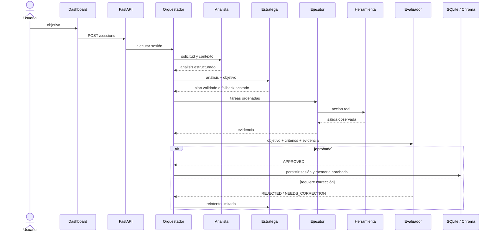
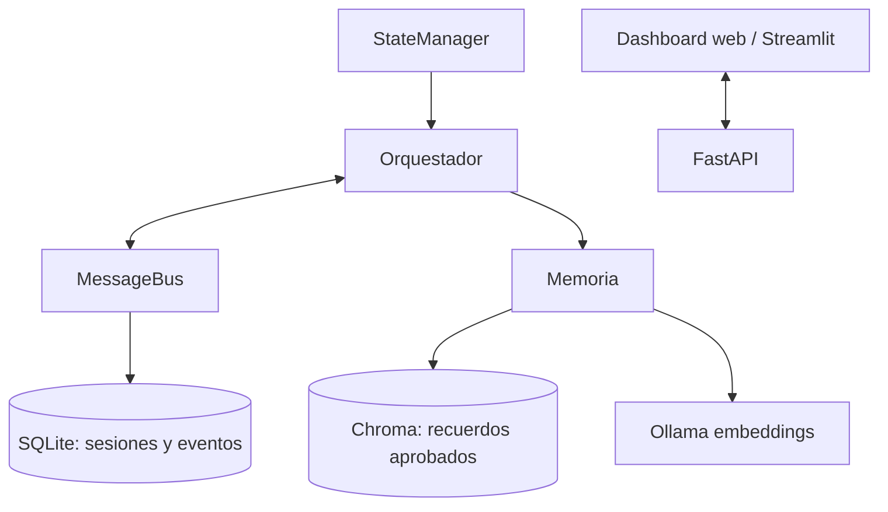

# Diagramas NEXO

## Secuencia de misión

```mermaid
sequenceDiagram
  actor U as Usuario
  participant UI as Dashboard
  participant API as FastAPI
  participant O as Orquestador
  participant A as Analista
  participant S as Estratega
  participant X as Ejecutor
  participant T as Herramienta
  participant E as Evaluador
  participant DB as SQLite / Chroma
  U->>UI: objetivo
  UI->>API: POST /sessions
  API->>O: ejecutar sesión
  O->>A: solicitud y contexto
  A-->>O: análisis estructurado
  O->>S: análisis + objetivo
  S-->>O: plan validado o fallback acotado
  O->>X: tareas ordenadas
  X->>T: acción real
  T-->>X: salida observada
  X-->>O: evidencia
  O->>E: objetivo + criterios + evidencia
  alt aprobado
    E-->>O: APPROVED
    O->>DB: persistir sesión y memoria aprobada
  else requiere corrección
    E-->>O: REJECTED / NEEDS_CORRECTION
    O->>S: reintento limitado
  end
```

## Datos

```mermaid
flowchart TD
  SM[StateManager] --> O[Orquestador]
  O <--> MB[MessageBus]
  MB --> SQL[(SQLite: sesiones y eventos)]
  O --> MEM[Memoria]
  MEM --> CH[(Chroma: recuerdos aprobados)]
  MEM --> EMB[Ollama embeddings]
  UI[Dashboard web / Streamlit] <--> API[FastAPI]
```
