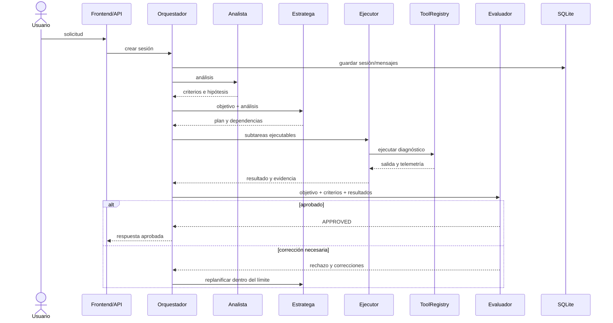
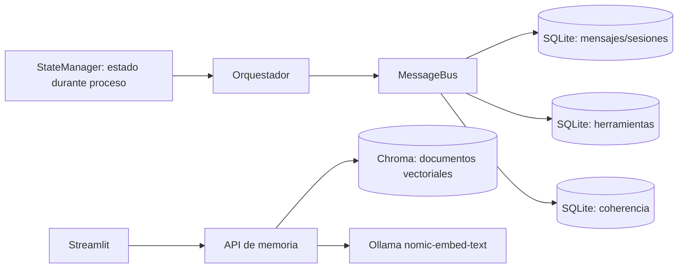

# Diagramas

## Recorrido de ejecución

```mermaid
sequenceDiagram
  actor Usuario
  participant UI as Frontend/API
  participant O as Orquestador
  participant A as Analista
  participant S as Estratega
  participant X as Ejecutor
  participant T as ToolRegistry
  participant V as Evaluador
  participant DB as SQLite
  Usuario->>UI: solicitud
  UI->>O: crear sesión
  O->>DB: guardar sesión/mensajes
  O->>A: análisis
  A-->>O: criterios e hipótesis
  O->>S: objetivo + análisis
  S-->>O: plan y dependencias
  O->>X: subtareas ejecutables
  X->>T: ejecutar diagnóstico
  T-->>X: salida y telemetría
  X-->>O: resultado y evidencia
  O->>V: objetivo + criterios + resultados
  alt aprobado
    V-->>O: APPROVED
    O-->>UI: respuesta aprobada
  else corrección necesaria
    V-->>O: rechazo y correcciones
    O->>S: replanificar dentro del límite
  end
```

## Almacenamiento

```mermaid
flowchart LR
  SM[StateManager: estado durante proceso] --> OR[Orquestador]
  OR --> MB[MessageBus]
  MB --> M[(SQLite: mensajes/sesiones)]
  MB --> T[(SQLite: herramientas)]
  MB --> C[(SQLite: coherencia)]
  UI[Streamlit] --> MEM[API de memoria]
  MEM --> VDB[(Chroma: documentos vectoriales)]
  MEM --> EMB[Ollama nomic-embed-text]
```
